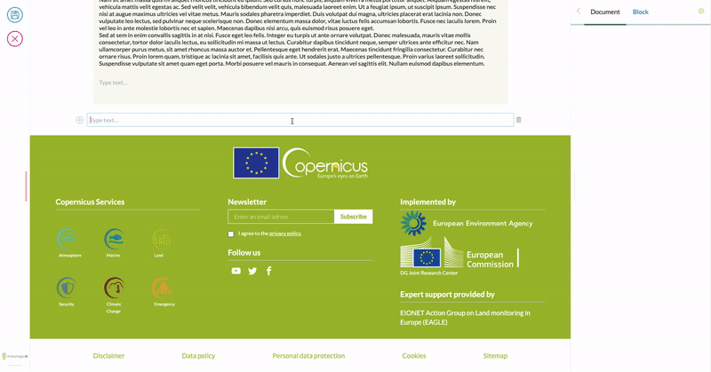
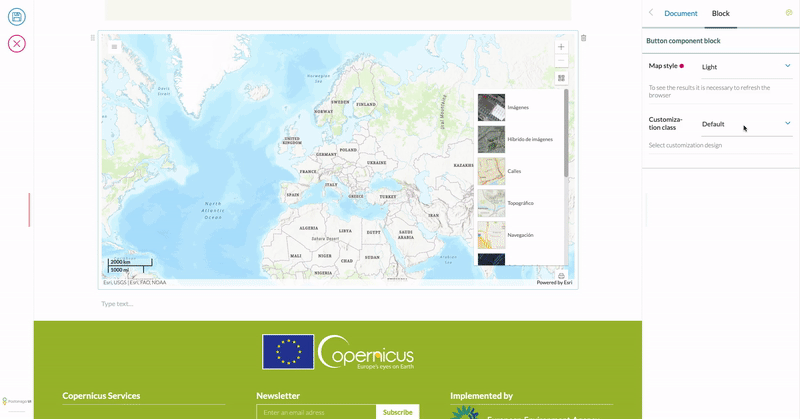

# [WIP] Volto Arcgis Block

[](https://github.com/eea/volto-arcgis-block/releases)

[](https://ci.eionet.europa.eu/view/Github/job/volto-addons/job/volto-arcgis-block/job/master/display/redirect)
[](https://sonarqube.eea.europa.eu/dashboard?id=volto-arcgis-block-master)
[](https://sonarqube.eea.europa.eu/dashboard?id=volto-arcgis-block-master)
[](https://sonarqube.eea.europa.eu/dashboard?id=volto-arcgis-block-master)
[](https://sonarqube.eea.europa.eu/dashboard?id=volto-arcgis-block-master)

[](https://ci.eionet.europa.eu/view/Github/job/volto-addons/job/volto-arcgis-block/job/develop/display/redirect)
[](https://sonarqube.eea.europa.eu/dashboard?id=volto-arcgis-block-develop)
[](https://sonarqube.eea.europa.eu/dashboard?id=volto-arcgis-block-develop)
[](https://sonarqube.eea.europa.eu/dashboard?id=volto-arcgis-block-develop)
[](https://sonarqube.eea.europa.eu/dashboard?id=volto-arcgis-block-develop)

## ArcGIS Map integration for Volto blocks

This Volto block allows adding a map block into your site but it has several dependencies.

This block has been implemented to fit the needs of the Copernicus Land Monitoring Service, and as such,
it requires an specific endpoint on the Plone site to retrieve the information to be shown in the map.

This endpoint is called `@mapviewer` and an example implementation is in the [clms.types](https://github.com/eea/clms.types/blob/master/clms/types/restapi/mapviewer_service/lrf_get.py) product.

This means that the product is not generic enough to show any ArcGIS map.



## Styling
To create custom styles, we need to add it in the block configuration and import the Less file into our project.

1. Add the new styles in the [custom Blocks configuration](https://docs.voltocms.com/blocks/settings/#configuring-a-new-block):

````JS
import { ARCGIS_BLOCK } from '@eeacms/volto-arcgis-block/constants';

const customBlocks = (config) => ({
  ...config.blocks.blocksConfig,
  [ARCGIS_BLOCK]: {
    ...config.blocks.blocksConfig[ARCGIS_BLOCK],
    styles: {
      ...config.blocks.blocksConfig[ARCGIS_BLOCK]?.styles,
      land: {
        title: 'Land style',
        customClass: 'land',
      },
    },
  },
````

2. Import the CSS in your project:

````CSS
@import url('maps.less');
````
3. CSS structure:
````LESS
.land { // <-- Wrap your design inside a class with the name you used in customClass
    .map {
        width: 100%;
        height: 600px;
        padding: 0;
        margin: 0;
    }

    .esri-view .esri-view-surface--inset-outline:focus::after {
        outline: none !important;
    }

    .esri-component.esri-zoom.esri-widget {
        margin-bottom: 0;
        box-shadow: none;
    }
}
````


***Note: If the style selector does not show your new style, try to change the order of the declaration of the addons in package.json, giving preference to volto-arcgis-block***
````
"addons": [
    "@eeacms/volto-arcgis-block",
    "@eeacms/volto-clms-theme"
  ],
````


## Release

### Automatic release using Jenkins

*  The automatic release is started by creating a [Pull Request](../../compare/master...develop) from `develop` to `master`. The pull request status checks correlated to the branch and PR Jenkins jobs need to be processed successfully. 1 review from a github user with rights is mandatory.
* It runs on every commit on `master` branch, which is protected from direct commits, only allowing pull request merge commits.
* The automatic release is done by [Jenkins](https://ci.eionet.europa.eu). The status of the release job can be seen both in the Readme.md badges and the green check/red cross/yellow circle near the last commit information. If you click on the icon, you will have the list of checks that were run. The `continuous-integration/jenkins/branch` link goes to the Jenkins job execution webpage.
* Automated release scripts are located in the `eeacms/gitflow` docker image, specifically [js-release.sh](https://github.com/eea/eea.docker.gitflow/blob/master/src/js-release.sh) script. It  uses the `release-it` tool.
* As long as a PR request is open from develop to master, the PR Jenkins job will automatically re-create the CHANGELOG.md and package.json files to be production-ready.
* The version format must be MAJOR.MINOR.PATCH. By default, next release is set to next minor version (with patch 0).
* You can manually change the version in `package.json`.  The new version must not be already present in the tags/releases of the repository, otherwise it will be automatically increased by the script. Any changes to the version will trigger a `CHANGELOG.md` re-generation.
* Automated commits and commits with [JENKINS] or [YARN] in the commit log are excluded from `CHANGELOG.md` file.

### Manual release from the develop branch ( beta release )

#### Installation and configuration of release-it

You need to first install the [release-it](https://github.com/release-it/release-it)  client.

   ```
   npm install -g release-it
   ```

Release-it uses the configuration written in the [`.release-it.json`](./.release-it.json) file located in the root of the repository.

Release-it is a tool that automates 4 important steps in the release process:

1. Version increase in `package.json` ( increased from the current version in `package.json`)
2. `CHANGELOG.md` automatic generation from commit messages ( grouped by releases )
3. GitHub release on the commit with the changelog and package.json modification on the develop branch
4. NPM release ( by default it's disabled, but can be enabled in the configuration file )

To configure the authentification, you need to export GITHUB_TOKEN for [GitHub](https://github.com/settings/tokens)

   ```
   export GITHUB_TOKEN=XXX-XXXXXXXXXXXXXXXXXXXXXX
   ```

 To configure npm, you can use the `npm login` command or use a configuration file with a TOKEN :

   ```
   echo "//registry.npmjs.org/:_authToken=YYYYYYYYYYYYYYYYYYYYYYYYYYYYYY" > .npmrc
   ```

#### Using release-it tool

There are 3 yarn scripts that can be run to do the release

##### yarn release-beta

Automatically calculates and presents 3 beta versions - patch, minor and major for you to choose ( or Other for manual input).

```
? Select increment (next version):
❯ prepatch (0.1.1-beta.0)
  preminor (0.2.0-beta.0)
  premajor (1.0.0-beta.0)
  Other, please specify...
```

##### yarn release-major-beta

Same as `yarn release-beta`, but with premajor version pre-selected.

##### yarn release

Generic command, does not automatically add the `beta` to version, but you can still manually write it if you choose Other.

#### Important notes

> Do not use release-it tool on master branch, the commit on CHANGELOG.md file and the version increase in the package.json file can't be done without a PULL REQUEST.

> Do not keep Pull Requests from develop to master branches open when you are doing beta releases from the develop branch. As long as a PR to master is open, an automatic script will run on every commit and will update both the version and the changelog to a production-ready state - ( MAJOR.MINOR.PATCH mandatory format for version).


## How to contribute

See [DEVELOP.md](https://github.com/eea/volto-arcgis-block/blob/master/DEVELOP.md).

